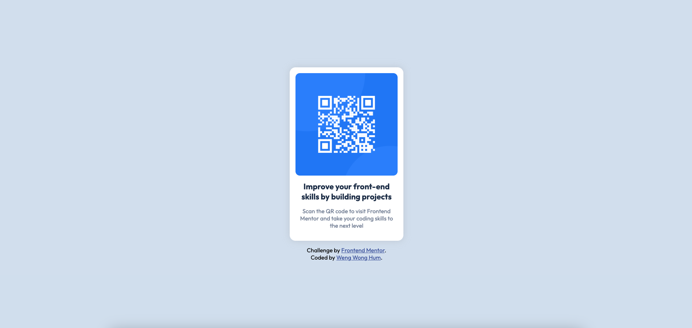

# Frontend Mentor - QR code component solution

This is a solution to the [QR code component challenge on Frontend Mentor](https://www.frontendmentor.io/challenges/qr-code-component-iux_sIO_H). Frontend Mentor challenges help you improve your coding skills by building realistic projects.

## Table of contents

- [Overview](#overview)
  - [Screenshot](#screenshot)
  - [Links](#links)
- [My process](#my-process)
  - [Built with](#built-with)
  - [What I learned](#what-i-learned)
  - [Continued development](#continued-development)
  - [Useful resources](#useful-resources)
- [Author](#author)

## Overview

### Screenshot

### Links

- Solution URL: [https://www.frontendmentor.io/solutions/qr-code-component-using-html-and-css-pn07w9pcPe](https://www.frontendmentor.io/solutions/qr-code-component-using-html-and-css-pn07w9pcPe)
- Live Site URL: [https://wengwongg.github.io/qr-code-component/](https://wengwongg.github.io/qr-code-component/)

## My process

### Built with

- Semantic HTML5 markup
- CSS custom properties
- Flexbox
- Mobile-first workflow

### What I learned

This was a relatively simple challenge, but it helped me to refine my basics. I practised using the BEM CSS naming convention, and focused on writing clean code that follows the DRY principle.

I also practised estimating widths and spacing needed to follow the intended design. Lastly, I also focused on using the appropriate CSS units and clarified my understanding on how each of them work.

### Continued development

I'd like to try to use CSS grid more instead of just flexbox. I also think that this project was a bit too simple and somewhat boring, so I'd like to attempt more complex projects next time.

## Author

- Frontend Mentor - [@wengwongg](https://www.frontendmentor.io/profile/wengwongg)
